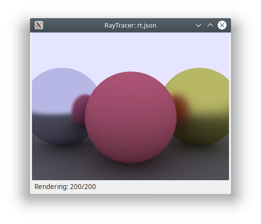

# raytracer
Simple ray tracer based on Peter Shirley's really execllent [Ray Tracing in a Weekend](http://www.realtimerendering.com/raytracing/Ray%20Tracing%20in%20a%20Weekend.pdf) book. I plan to port to the GPU using CUDA once basic features are implemented.

Currently it is only capable of drawing spheres. Scene definition is contained in a json file passed as a parameter.

Progressively renders scene with increasing rays/pixel to reduce noise. Rudimentary camera motion via mouse (left drag points camera, right drag moves camera, scroll wheel zooms). "Real-time" rendering at low quality renders.

### Build and run:
```
$ make
$ ./rt rt.json
```



### Dependencies:
- [JsonCpp](https://github.com/open-source-parsers/jsoncpp)
- [wxWidgets](https://www.wxwidgets.org/)
